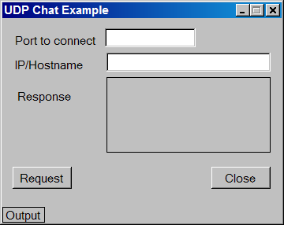
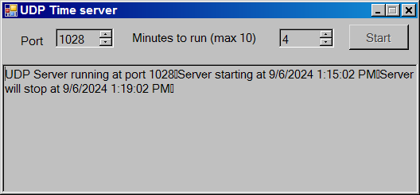

# Entendiendo la programación de Sockets UDP con C# 
		

UDP (User Datagram Protocol) es un protocolo de datagramas, no orientado a la conexión mucho más sencillo, poco fiable y de alto rendimiento, que a diferencia de TCP no incluye todas características para garantizar la entrega de paquetes, tales como recuperación de fallas, chequeo de errores o control de flujo.
			Debido a estas características UDP debe utilizarse en casos específicos, donde se asuma que el rendimiento es mejor que la fiabilidad:

<ol>
<li>Cuando se transmite una pequeña cantidad de datos en periodos muy cortos de tiempo.</li>
<li>Aplicaciones de “consulta y respuesta”, que trasmiten una consulta y esperan una respuesta inmediata.</li>
<li>En sistemas de compresión para la transmisión de audio y video que pueden aceptar cierta cantidad de corrupción o perdida de paquetes.</li>
<li>Algunas aplicaciones tienen su propio mecanismo de entrega de transporte, así que no necesitan de una capa de transporte. Estas aplicaciones usaran UDP mas eficientemente que TCP.</li>
</ol>

Por su rendimiento, UDP es recomendable en aplicaciones en donde es aceptable que algunos paquetes se pierdan durante la comunicación, como video streaming de video o algún protocolo multicasting como DNS.

La cabecera UDP tiene solo 4 campos: puerto origen, puerto destino, longitud y checksum. Los campos origen y destino tiene la misma funcionalidad que se tienen en la cabecera TCP. La longitud del campo especifica la longitud de la cabecera UDP y el campo checksum permite la revisar integridad del paquete.

<b>Fig 1  Los campos del paquete UDP.</b>
 

	
	

	<h3>La clase UDPClient</h3>
	

	La clase <a href="https://msdn.microsoft.com/en-us/library/system.net.sockets.udpclient(v=vs.110).aspx"><b>UdpClient</b></a> es responsable de manejar mensajes punto a punto (point-to-point) y multicasting con el protocolo UDP; la clase UdpClient utiliza endpoints, esta clase puede ser construida inicialmente con el parámetro de un host o bien este parámetro puede especificarse durante el método <i>Send()</i>.
	

Tambien proporciona un método <i>Receive()</i> que bloquea el hilo de ejecución hasta que un datagrama es recibido.

La clase <b>UdpClient</b> es una pequeña interfaz comparado a la clase <b>TcpClient</b>. Esto refleja la simple naturaleza de este protocolo en comparación con TCP. Mientras que ambas clases TcpClient y UdpClient utilizan un Socket internamente, la clase UdpClient no contiene un método para regresar un flujo de red (stream) para escribir y leer, en lugar de eso tiene un método <i>Send()</i> que acepta un arreglo de bytes como parámetro, mientras el método <i>Receive()</i> recibe un arreglo de bytes.

<b>Fig 2 Miembros esenciales de la clase UDP Client.</b>
 
<table>
			<tr>
				<td><b>Metodo o propiedad</b></td>
				<td><b>Descripción</b></td>
			</tr>
			<tr>
				<td>Receive</td>
				<td>Recibe un datagrama UDP que fue enviado por una máquina remota.</td>
			</tr>
			<tr>
				<td>Send</td>
				<td>Envia un datagrama UDP a una máquina remota.</td>
			</tr>
			<tr>
				<td>Client</td>
				<td>Obtiene el socket subyacente que utiliza la clase.</td>
			</tr>
</table>
<h3>Ejemplo de una comunicación entre un clientes y un servidor UDP</h3>

Es importante entender que en un modelo de comunicación sin conexión como UDP la comunicación se limita estrictamente a un modelo de petición/respuesta, que se lleva de la siguiente manera:

<b>Fig 3 Modelo de comunicación petición/respuesta</b>
 

 

Cada petición es un arreglo de bytes se salida procedente del cliente. Este arreglo de bytes se envía al servidor mediante TCP/IP, donde se convierte en la entrada del servidor. La respuesta entonces es el arreglo de bytes que salen del servidor para actuar como la entrada del cliente.
Debido a la simpleza de este modelo, presenta las siguientes limitaciones:

			<ul>
				<li>Falta de conexión continua</li>
				<li>Falta de fiabilidad</li>
				<li>Seguridad insuficiente</li>
			</ul>

Para mostrar como trabaja la comunicación entre un cliente y un servidor UDP utilizando la clase UdpClient escribí dos programas: un servidor y un cliente UDP.
			Ambos programas utilizan una interfaz de usuario (GUI) en GTK# para comunicarse entre ellos.
			

			
<b>Fig 4 Ejemplo de un time server UDP con una GUI GTK#</b>

			

			
			

			
<b>Fig 5 Ejemplo de un cliente UDP con una GUI GTK#</b>

			

			
			

			<h3>Pasos para la construcción de un servidor UDP GTK#</h3>
			

El servidor UDP envía la fecha y la hora actual de la máquina a los clientes que se conecten en su número de puerto, durante los minutos que el servidor se encuentre activo, ambos el número de puerto y los minutos son especificados por el usuario en la pantalla.

El proyecto del servidor se compone de dos clases:

<ol>
<li>La clase <b>MainWindowServer.cs</b> es la clase que construye la GUI del programa, obtiene los parámetros: número de puerto y minutos de ejecución del subproceso servidor, informa acerca de su estado o las posibles excepciones.</li>
<li>La clase <b>Program.cs</b> es la clase principal que donde se ejecuta el servidor.</li>
</ol>

Para construir un servidor UDP se requieren de los siguientes pasos:

1) Crear una objeto <i>UdpClient</i> que al construirse sin argumentos se le asigna un número de puerto de la IP local.

			<pre>
				UdpClient udpClient = new UdpClient();
			</pre>

2) Construir un objeto IPEndpoint asociando una IP para este ejemplo utilice la dirección local y el número de puerto donde se conectara para enviar la respuesta (response) del servidor.

<pre>
		IPEndPoint IPremoteEP = new IPEndPoint(IPAddress.Parse("127.0.0.1"),serverPort);
</pre>

3) Utilizar la clase <i>Encoding</i> para convertir el texto de la respuesta en un arreglo de bytes UTF8, y enviarla por la red con el método <i>Send()</i>.

	<pre>
			byte[] data = Encoding.UTF8.GetBytes(response.ToString());
			udpClient.Send(data,data.Length,IPremoteEP);
	</pre>
<h3>Pasos para la construcción de un cliente UDP GTK#</h3>

El cliente UDP solicita un petición al número de puerto del servidor, recibiendo la respuesta como una matriz de bytes, la convierte a una cadena y la muestra en la pantalla.

El proyecto del cliente UDP GTK# se compone de 2 clientes:

<ol>
 <li>1. La clase <b>MainWindow.cs</b> es la clase que construye la GUI del cliente, solicita los parámetros: numero de puerto y dirección IP para configurar la comunicación, maneja los eventos para recibir la respuesta del servidor y mostrar el resultado en pantalla o las posibles excepciones.
</li>
 <li>2. La clase <b>Program.cs</b> es la clase principal donde se ejecuta el cliente</li>
</ol>

Para construir un cliente UDP se requieren de los siguientes pasos:

1) Se crea un objeto UdpClient y se le especifica como parámetro el número de puerto al cual se enlazará.

<pre>
	UdpClient client = new UdpClient(portToReceive);
</pre>

2) Se crea el IPEndPoint para recibir la matriz de bytes con los parámetros IPAddress.Any (Indica que el servidor debe escuchar por clientes en todas las interfaces de red) y el número de puerto cero (para solicitar números de puertos dinámicos).

<pre>
		IPEndPoint anyIP = new IPEndPoint(IPAddress.Any, 0);
</pre>

3) Se obtiene el arreglo de bytes del IPEndPoint

<pre>
	byte[] data = client.Receive(ref anyIP);
</pre>

4) Se convierte el arreglo de bytes a una cadena

<pre>
		text = Encoding.UTF8.GetString(data);
</pre>

5) Una vez obtenido el mensaje se debe cerrar el Socket

<pre>
		client.Close();
</pre>

A continuación unas imágenes del cliente y del servidor comunicándose entre si.

<b>Fig 6 Configurando el servidor de fecha y hora</b>

	

<b>Fig 7 Ejecutando el servidor de fecha y hora</b>

	

<b>Fig 8 Ejecutando el cliente GTK# Udp</b>

	

<b>Fig 9 Obteniendo la respuesta de servidor UDP</b>

	

